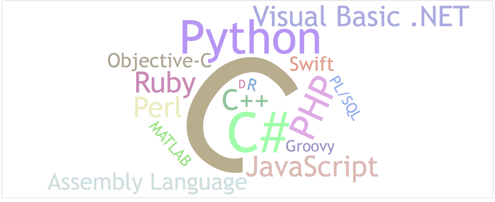
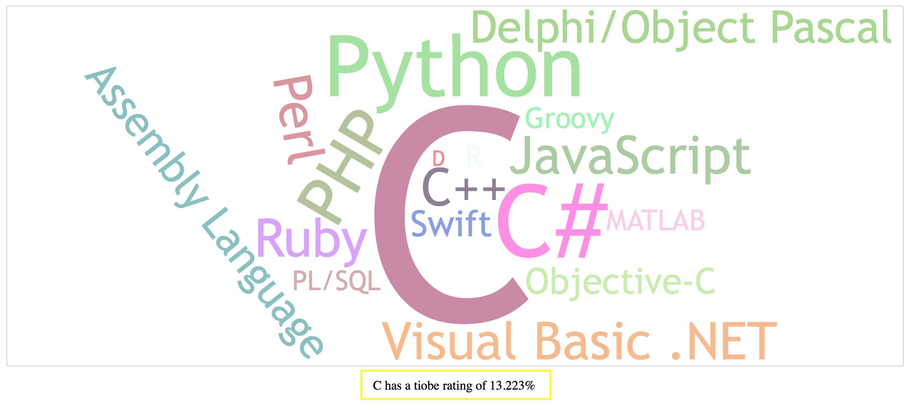

<h1><b><a href="https://mshehan.github.io/Tiobe/tiobe.html">Tiobe</a></b></h1>
Created a data visualization using open source word cloud from GitHub
Click on the title to view the final product. 

the tiobe is dynamic to the screen width and uses JavaScript to update the image size. Additionally, if you choose to click on the languages in the cloud they act as buttons that display the data set information concerning that particular language.

